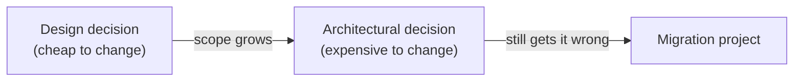

# Module 1: Introduction to Software Design & Architecture

Week 1

## Learning objectives

* Distinguish software architecture from software design, and know why the distinction matters
* Understand technical debt as a metaphor for the cost of postponing structural decisions
* Recognize the major quality attributes and be able to name the trade-offs between them
* Identify the stakeholders whose concerns shape an architecture, and why they often conflict

---

## 1. Architecture versus design

**Software architecture** is the set of decisions about a system's structure that are expensive to
change later: how the system is decomposed into components, how those components communicate, and
which quality attributes that structure trades off against each other. **Software design**, by
contrast, is the smaller-scale set of decisions inside one component: which classes exist, how they
collaborate, which pattern fits a specific problem.

A practical way to tell the two apart: a design decision is usually one you can change in an
afternoon by editing a class. An architectural decision is one you'd need a migration plan for.
Swapping a sorting algorithm inside a function is design. Swapping a relational database for an
event log that every service reads from is architecture. The whole point of this module, and much
of this course, is learning to recognize which kind of decision you're making *before* it becomes
expensive to undo.

Modules 2 through 4 stay mostly at the design scale: principles and patterns inside one component.
Modules 5 through 9 move to the architectural scale: how components are organized into a whole
system.

## 2. Why it matters: the cost of change

Every system accumulates structural shortcuts under deadline pressure: a class that grew a second
responsibility because splitting it felt like overkill at the time, a module that reaches directly
into another module's internals because a proper interface felt premature. **Technical debt** is
the common metaphor for this: like financial debt, a shortcut lets you move faster now, at the cost
of interest, extra effort, paid on every future change that touches the same area.

The metaphor is useful but has a real limit worth naming directly: financial debt has a known
interest rate and a payoff date. Technical debt's "interest rate" is often invisible until a team
tries to make an unrelated change and discovers how tangled the code has become. This is exactly
why quality attributes (§3) and architecture documentation (Module 9) matter: they make debt
visible before it compounds, rather than after.

The underlying pattern is a cost curve: the same structural mistake costs roughly ten times more to
fix the later it's caught, roughly following: caught while writing < caught in code review < caught
in testing < caught in production. Architecture is largely the discipline of catching structural
mistakes on the left side of that curve.

## 3. Quality attributes

A system's quality attributes (sometimes called the "-ilities") are the properties stakeholders
actually care about, beyond "does it do the right thing." No architecture optimizes all of them at
once, since improving one usually costs another:

| Quality attribute | What it means | A common cost |
|---|---|---|
| **Performance** | How fast the system responds under load | More caching and precomputation, more moving parts to keep consistent |
| **Availability** | How much uptime the system delivers | Redundancy, which adds operational complexity |
| **Security** | Resistance to unauthorized access or misuse | Extra validation and access-control layers slow development |
| **Maintainability** | How cheaply the system can be changed later | Time spent on structure now, instead of features now |
| **Testability** | How easily correctness can be verified | Extra seams (interfaces, dependency injection) that add indirection |
| **Scalability** | How gracefully the system handles growth | Distributed-systems complexity (Module 8) that a single-machine system never needs |
| **Usability** | How easily the system's actual users accomplish their goals | Constraints on internal structure to keep the interface simple |

A single architectural decision routinely trades one of these against another. Adding a cache
improves performance at the cost of maintainability, since now two copies of data can disagree.
Splitting a monolith into services (Module 7) improves scalability at the cost of the operational
complexity Module 8 exists to manage. Naming the trade-off explicitly, rather than discovering it
by accident, is the actual skill this course builds.

## 4. Stakeholders and competing concerns

An architecture rarely has one audience. A product owner cares about time-to-market and features.
An operations team cares about availability and observability. A security team cares about attack
surface. A future engineer, quite possibly you in six months, cares about maintainability. These
concerns are not automatically aligned: the fastest path to a demo often directly damages
maintainability, and the most secure design often damages usability.

Making these competing concerns explicit, instead of resolving them implicitly by whoever wrote the
code most recently, is what an architect's job actually is. Module 9 gives this a concrete format,
the Architecture Decision Record, whose whole purpose is writing the trade-off down where the next
person can find it.

## 5. Project: quality attribute audit of an open-source project (required)

Pick a small, real open-source project on GitHub (aim for something with fewer than 50 source
files, so you can actually read all of it). Examine its directory and module structure, then:

1. Identify 2-3 quality attributes from the table in §3 that the project's structure seems to
   prioritize. Point at specific evidence: a folder that exists only to isolate one concern, a
   heavy use of interfaces suggesting testability was a priority, extensive caching suggesting
   performance was prioritized over simplicity.
2. Identify one quality attribute the project's structure seems to have sacrificed, with evidence.
3. Write 200-300 words connecting your evidence to your conclusion. "It looks maintainable" is not
   evidence; "every external API call is isolated behind a single `Client` interface, which is only
   worth doing if testability or swappability mattered enough to justify the extra indirection" is.

---

## Summary

Architecture and design differ mainly in how expensive a decision is to reverse (§1), and technical
debt is what accumulates when structural decisions get deferred past the point where they're still
cheap to make well (§2). Every architectural decision trades one quality attribute against another
(§3), for a set of stakeholders whose priorities rarely all agree (§4). The rest of this course is
essentially a toolbox for making that trade-off deliberately: Modules 2-4 at the scale of one
component, Modules 5-9 at the scale of a whole system.

## Further reading

* See the [Course books](../README.md#course-books) for deeper dives on applied software
  architecture.

## References

Foundational sources this module's content draws on:

* Bass, Len, Clements, Paul, and Kazman, Rick. *Software Architecture in Practice.* 4th ed.,
  Addison-Wesley, 2021. Source for the quality attribute framing in §3 and the stakeholder
  discussion in §4.
* Fowler, Martin. ["TechnicalDebt."](https://martinfowler.com/bliki/TechnicalDebt.html)
  martinfowler.com. Source for the technical debt metaphor and its limits in §2.
