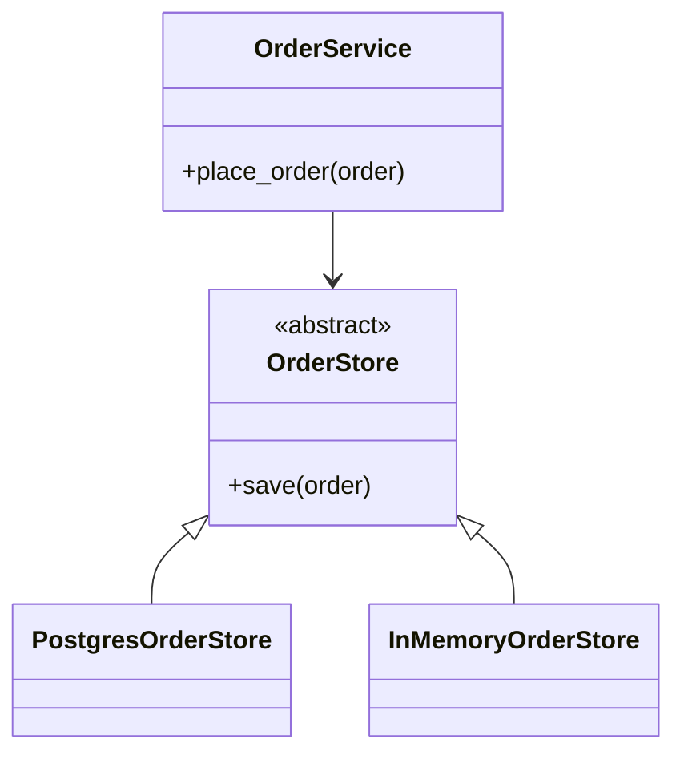

# Module 2: Object-Oriented Design Principles

Week 2

## Learning objectives

* Define coupling and cohesion, and recognize both in real code
* Apply each of the five SOLID principles, and recognize the violation each one fixes
* Refactor a class with multiple responsibilities into a set of well-separated ones

---

## 1. Coupling and cohesion

**Coupling** is how much one part of a codebase depends on the internal details of another.
**Cohesion** is how tightly the responsibilities inside one part actually belong together. The
goal is low coupling (a change in one place rarely forces a change elsewhere) and high cohesion (a
class does one clearly related set of things, not three unrelated ones).

A small illustration: a class that both parses a file format and renders that data to HTML has low
cohesion, since "parsing" and "rendering" are unrelated concerns bundled together, and every class
that imports it is now coupled to both. Splitting it into a parser and a renderer raises cohesion
in each piece and lets a caller depend on only the one it actually needs.

Every principle in §2 is, underneath, a specific technique for improving one or both of these.

## 2. The five SOLID principles

### Single Responsibility Principle (SRP)

*A class should have one reason to change.*

```python
# Before: two responsibilities, two reasons to change
class Invoice:
    def __init__(self, items: list[tuple[str, float]]):
        self.items = items

    def total(self) -> float:
        return sum(price for _, price in self.items)

    def print_receipt(self) -> None:
        print(f"Total: ${self.total():.2f}")
        for name, price in self.items:
            print(f"  {name}: ${price:.2f}")
```

If the receipt format changes, `Invoice` changes. If the pricing rule changes, `Invoice` also
changes. Two unrelated reasons to touch the same class means a formatting change risks breaking
pricing logic it never needed to see.

```python
# After: one responsibility each
class Invoice:
    def __init__(self, items: list[tuple[str, float]]):
        self.items = items

    def total(self) -> float:
        return sum(price for _, price in self.items)


class ReceiptPrinter:
    def print(self, invoice: Invoice) -> None:
        print(f"Total: ${invoice.total():.2f}")
        for name, price in invoice.items:
            print(f"  {name}: ${price:.2f}")
```

### Open/Closed Principle (OCP)

*A class should be open for extension, but closed for modification.*

```python
# Before: adding a shape means editing this function
def area(shape: dict) -> float:
    if shape["kind"] == "circle":
        return 3.14159 * shape["radius"] ** 2
    elif shape["kind"] == "rectangle":
        return shape["width"] * shape["height"]
    raise ValueError("unknown shape")
```

Every new shape means editing a function that every existing shape already depends on, risking a
regression in code that used to work.

```python
# After: adding a shape means adding a class, not editing existing ones
from abc import ABC, abstractmethod

class Shape(ABC):
    @abstractmethod
    def area(self) -> float: ...

class Circle(Shape):
    def __init__(self, radius: float):
        self.radius = radius
    def area(self) -> float:
        return 3.14159 * self.radius ** 2

class Rectangle(Shape):
    def __init__(self, width: float, height: float):
        self.width, self.height = width, height
    def area(self) -> float:
        return self.width * self.height
```

### Liskov Substitution Principle (LSP)

*A subclass should be usable anywhere its parent class is expected, without surprising behavior.*

```python
# Before: Square silently breaks what Rectangle promises
class Rectangle:
    def __init__(self, width: float, height: float):
        self.width, self.height = width, height
    def set_width(self, width: float) -> None:
        self.width = width

class Square(Rectangle):
    def set_width(self, width: float) -> None:
        self.width = self.height = width  # also changes height: a surprise
```

Any code written against `Rectangle` reasonably assumes `set_width` only changes the width. A
`Square` passed in where a `Rectangle` is expected silently violates that assumption, and a test
that passes for every `Rectangle` can fail the moment a `Square` is substituted in.

```python
# After: Square is not a Rectangle subtype; both implement a shared shape interface instead
class Shape(ABC):
    @abstractmethod
    def area(self) -> float: ...

class Rectangle(Shape):
    def __init__(self, width: float, height: float):
        self.width, self.height = width, height
    def area(self) -> float:
        return self.width * self.height

class Square(Shape):
    def __init__(self, side: float):
        self.side = side
    def area(self) -> float:
        return self.side ** 2
```

### Interface Segregation Principle (ISP)

*A class should not be forced to depend on methods it doesn't use.*

```python
# Before: every printer must implement scan and fax, even a printer that can't
class MultiFunctionDevice(ABC):
    @abstractmethod
    def print(self, doc) -> None: ...
    @abstractmethod
    def scan(self, doc) -> None: ...
    @abstractmethod
    def fax(self, doc) -> None: ...

class BasicPrinter(MultiFunctionDevice):
    def print(self, doc) -> None:
        ...
    def scan(self, doc) -> None:
        raise NotImplementedError  # forced to implement something it can't do
    def fax(self, doc) -> None:
        raise NotImplementedError
```

```python
# After: split into focused interfaces; implement only what applies
class Printer(ABC):
    @abstractmethod
    def print(self, doc) -> None: ...

class Scanner(ABC):
    @abstractmethod
    def scan(self, doc) -> None: ...

class BasicPrinter(Printer):
    def print(self, doc) -> None:
        ...
```

### Dependency Inversion Principle (DIP)

*High-level code should depend on abstractions, not on concrete low-level implementations.*

```python
# Before: OrderService is hardwired to one specific database
class PostgresOrderStore:
    def save(self, order) -> None:
        ...

class OrderService:
    def __init__(self):
        self.store = PostgresOrderStore()  # concrete dependency, created inside

    def place_order(self, order) -> None:
        self.store.save(order)
```

Testing `OrderService` now requires a real Postgres connection, and swapping storage engines means
editing `OrderService` itself, exactly the coupling §1 warned about.

```python
# After: OrderService depends on an abstraction, supplied from outside
class OrderStore(ABC):
    @abstractmethod
    def save(self, order) -> None: ...

class PostgresOrderStore(OrderStore):
    def save(self, order) -> None:
        ...

class OrderService:
    def __init__(self, store: OrderStore):
        self.store = store  # injected, not created

    def place_order(self, order) -> None:
        self.store.save(order)
```

Now a test can pass in an in-memory fake `OrderStore`, and swapping databases means writing a new
`OrderStore` implementation, never touching `OrderService`.



## 3. Project: refactor a God class (required)

Start from this class, which violates SRP (it handles validation, persistence, and notification),
OCP (a new discount type means editing `apply_discount`), and DIP (it constructs its own database
connection):

```python
class OrderProcessor:
    def __init__(self):
        self.db = connect_to_database()  # concrete dependency, created inside

    def process(self, order: dict) -> None:
        if not order.get("items"):
            raise ValueError("empty order")
        if order.get("discount_code") == "SAVE10":
            order["total"] *= 0.9
        elif order.get("discount_code") == "SAVE20":
            order["total"] *= 0.8
        self.db.execute("INSERT INTO orders VALUES (?)", order)
        send_email(order["customer_email"], "Your order was placed")
        print(f"Order processed: {order}")
```

Refactor it into at least four collaborating classes: something that validates an order, something
that represents a discount (with a shared interface so a new discount type doesn't require editing
existing code), something that persists an order (behind an interface, injected rather than
constructed inside), and something that notifies the customer. Write a short test for the
validation logic that requires no database or email server, to prove the refactor actually
improved testability, not just moved code around.

---

## Summary

Coupling and cohesion (§1) are the underlying measures every SOLID principle (§2) is a specific
technique for improving. SRP and ISP raise cohesion by keeping responsibilities narrow. OCP, LSP,
and DIP lower coupling by making it safe to extend or substitute behavior without editing code that
already works. Module 3 picks this up directly: most classic design patterns are named,
well-tested ways of applying exactly these principles to a recurring class of problem.

## Further reading

* See the [Course books](../README.md#course-books) for deeper dives on applied software
  architecture.

## References

Foundational sources this module's content draws on:

* Martin, Robert C. *Clean Architecture: A Craftsman's Guide to Software Structure and Design.*
  Prentice Hall, 2017. Source for the SOLID principle definitions and framing throughout §2.
* Martin, Robert C. ["The Principles of OOD."](https://web.archive.org/web/20150906155800/http://butunclebob.com/ArticleS.UncleBob.PrinciplesOfOod)
  Object Mentor. The original essay defining SRP, OCP, LSP, ISP, and DIP.
