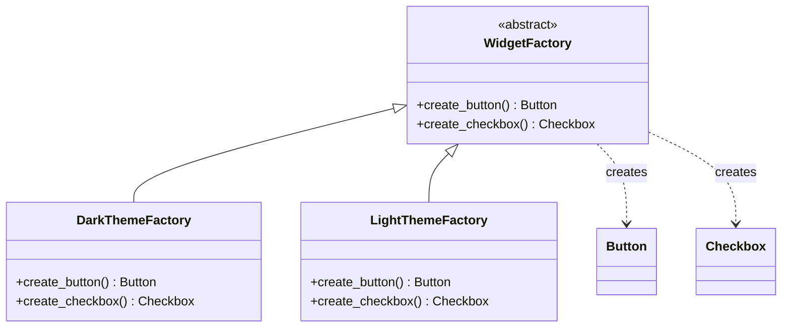
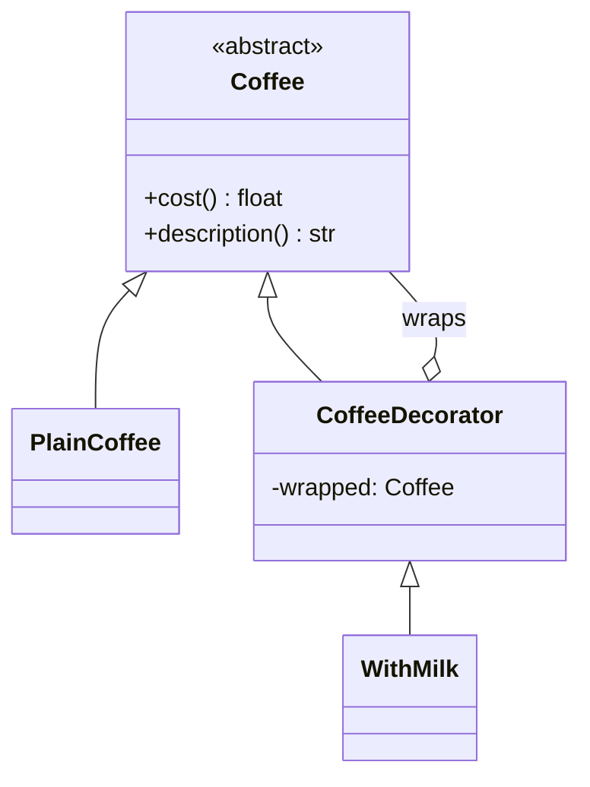

# Module 3: Design Patterns I (Creational & Structural)

Week 3

## Learning objectives

* Explain what a design pattern is, and just as importantly, what it is not
* Implement the four classic creational patterns: Factory Method, Abstract Factory, Builder, and
  Singleton, and recognize when each one is worth its cost
* Implement the four structural patterns covered here: Adapter, Decorator, Facade, and Composite
* Match a concrete design problem to the pattern that actually fits it, rather than reaching for
  the first one that comes to mind

---

## 1. What a design pattern is, and what it is not

A **design pattern** is a named, reusable solution to a design problem that recurs across many
codebases: not a finished piece of code you copy in, but a shape of solution you adapt to your own
classes and constraints. The value of a pattern is mostly the *name*: once a team agrees "this is a
Decorator," a one-word conversation replaces a ten-minute explanation of the class structure.

What a pattern is not: a guarantee of good design. Patterns solve a problem that is actually
present. Reaching for Factory Method when a plain constructor would do, or wrapping a Singleton
around global state because "it might need to be swapped out one day," adds a layer of indirection
that has to be understood and maintained forever, for a flexibility nobody ends up using. Pattern
overuse is a real code smell, sometimes called "pattern-itis," and this module tries to name the
cost of each pattern alongside its benefit, not just the benefit.

## 2. Creational patterns

Creational patterns are about *how an object gets constructed*, separating the calling code from
the concrete class being instantiated.

### 2.1 Factory Method

**Reach for this when:** a class needs to create an object, but which concrete subclass to
instantiate should be decided by a subclass of the creator, not hardcoded.

```python
from abc import ABC, abstractmethod


class Notifier(ABC):
    @abstractmethod
    def send(self, message: str) -> None: ...


class EmailNotifier(Notifier):
    def send(self, message: str) -> None:
        print(f"Emailing: {message}")


class SmsNotifier(Notifier):
    def send(self, message: str) -> None:
        print(f"Texting: {message}")


class NotificationService(ABC):
    @abstractmethod
    def create_notifier(self) -> Notifier: ...

    def notify(self, message: str) -> None:
        notifier = self.create_notifier()  # the factory method
        notifier.send(message)


class EmailNotificationService(NotificationService):
    def create_notifier(self) -> Notifier:
        return EmailNotifier()
```

The caller works with `NotificationService` and never names `EmailNotifier` directly; adding a new
channel means adding a new subclass, not editing existing code.

### 2.2 Abstract Factory

**Reach for this when:** you need to create *families* of related objects that must stay
consistent with each other (for example, every widget in one UI theme).

```python
from abc import ABC, abstractmethod


class Button(ABC):
    @abstractmethod
    def render(self) -> str: ...


class Checkbox(ABC):
    @abstractmethod
    def render(self) -> str: ...


class DarkButton(Button):
    def render(self) -> str:
        return "[dark button]"


class DarkCheckbox(Checkbox):
    def render(self) -> str:
        return "[dark checkbox]"


class LightButton(Button):
    def render(self) -> str:
        return "[light button]"


class LightCheckbox(Checkbox):
    def render(self) -> str:
        return "[light checkbox]"


class WidgetFactory(ABC):
    @abstractmethod
    def create_button(self) -> Button: ...

    @abstractmethod
    def create_checkbox(self) -> Checkbox: ...


class DarkThemeFactory(WidgetFactory):
    def create_button(self) -> Button:
        return DarkButton()

    def create_checkbox(self) -> Checkbox:
        return DarkCheckbox()
```



Swapping `DarkThemeFactory` for `LightThemeFactory` anywhere in the code changes every widget it
produces at once, and it is structurally impossible to accidentally mix a dark button with a light
checkbox.

### 2.3 Builder

**Reach for this when:** an object has many optional parameters or must be assembled in steps, and
a constructor with ten keyword arguments (most of them optional) is becoming unreadable.

```python
class HttpRequest:
    def __init__(self) -> None:
        self.method = "GET"
        self.url = ""
        self.headers: dict[str, str] = {}
        self.body: str | None = None

    def __repr__(self) -> str:
        return f"{self.method} {self.url} headers={self.headers} body={self.body!r}"


class HttpRequestBuilder:
    def __init__(self) -> None:
        self._request = HttpRequest()

    def method(self, method: str) -> "HttpRequestBuilder":
        self._request.method = method
        return self

    def url(self, url: str) -> "HttpRequestBuilder":
        self._request.url = url
        return self

    def header(self, key: str, value: str) -> "HttpRequestBuilder":
        self._request.headers[key] = value
        return self

    def body(self, body: str) -> "HttpRequestBuilder":
        self._request.body = body
        return self

    def build(self) -> HttpRequest:
        return self._request


request = (
    HttpRequestBuilder()
    .method("POST")
    .url("https://api.example.com/orders")
    .header("Content-Type", "application/json")
    .body('{"item": "book"}')
    .build()
)
```

Each call reads like a sentence, and the object cannot exist in a half-configured state once
`build()` returns.

### 2.4 Singleton, and its real cost

**Reach for this when:** you need exactly one instance of something coordinating access to a
genuinely shared resource, most often a logging sink or a connection pool.

```python
class ConfigRegistry:
    _instance: "ConfigRegistry | None" = None

    def __new__(cls) -> "ConfigRegistry":
        if cls._instance is None:
            cls._instance = super().__new__(cls)
            cls._instance._settings = {}
        return cls._instance

    def set(self, key: str, value: str) -> None:
        self._settings[key] = value

    def get(self, key: str) -> str | None:
        return self._settings.get(key)
```

The cost, stated plainly: a Singleton is global mutable state with a design pattern's name on it.
It makes unit tests harder to isolate (one test's mutation leaks into the next unless you
explicitly reset it), and it hides a dependency that a constructor argument would have made
visible. Before reaching for Singleton, check whether passing the shared object explicitly (as a
constructor or function argument) solves the same problem without the global state; it almost
always does, and Module 2's dependency inversion principle (Module 2, §5) is exactly the tool for
making that dependency explicit instead of hidden.

## 3. Structural patterns

Structural patterns are about *how objects and classes are composed* into larger structures,
without changing what those objects actually do.

### 3.1 Adapter

**Reach for this when:** you have an existing class with a useful interface, and new code expects a
different, incompatible interface, and you cannot (or should not) change either side.

```python
class LegacyPaymentGateway:
    def make_payment(self, amount_cents: int) -> bool:
        print(f"Charging {amount_cents} cents via legacy gateway")
        return True


class PaymentProcessor:  # the interface new code expects
    def process(self, amount_dollars: float) -> bool: ...


class LegacyGatewayAdapter(PaymentProcessor):
    def __init__(self, legacy_gateway: LegacyPaymentGateway) -> None:
        self._legacy_gateway = legacy_gateway

    def process(self, amount_dollars: float) -> bool:
        return self._legacy_gateway.make_payment(round(amount_dollars * 100))
```

New code depends only on `PaymentProcessor`; the adapter is the one place that knows the legacy
gateway's cents-based, boolean-returning quirks.

### 3.2 Decorator

**Reach for this when:** you want to add behavior to an individual object at runtime, and
subclassing every combination of behaviors would explode combinatorially.

```python
from abc import ABC, abstractmethod


class Coffee(ABC):
    @abstractmethod
    def cost(self) -> float: ...

    @abstractmethod
    def description(self) -> str: ...


class PlainCoffee(Coffee):
    def cost(self) -> float:
        return 2.0

    def description(self) -> str:
        return "coffee"


class CoffeeDecorator(Coffee):
    def __init__(self, wrapped: Coffee) -> None:
        self._wrapped = wrapped

    def cost(self) -> float:
        return self._wrapped.cost()

    def description(self) -> str:
        return self._wrapped.description()


class WithMilk(CoffeeDecorator):
    def cost(self) -> float:
        return self._wrapped.cost() + 0.5

    def description(self) -> str:
        return f"{self._wrapped.description()} + milk"


order = WithMilk(WithMilk(PlainCoffee()))
print(order.description(), order.cost())  # coffee + milk + milk 3.0
```



Each decorator wraps the same interface it implements, so decorators stack in any order and any
number, without a combinatorial explosion of subclasses like `CoffeeWithMilkAndSugar`.

### 3.3 Facade

**Reach for this when:** a subsystem has many classes with a genuinely complex interaction, and
most callers only need one simple entry point into it.

```python
class InventoryService:
    def reserve(self, item_id: str, qty: int) -> bool:
        print(f"Reserving {qty} of {item_id}")
        return True


class PaymentService:
    def charge(self, amount: float) -> bool:
        print(f"Charging ${amount}")
        return True


class ShippingService:
    def schedule(self, item_id: str) -> str:
        return f"tracking-{item_id}-001"


class OrderFacade:
    def __init__(self) -> None:
        self._inventory = InventoryService()
        self._payment = PaymentService()
        self._shipping = ShippingService()

    def place_order(self, item_id: str, qty: int, amount: float) -> str:
        self._inventory.reserve(item_id, qty)
        self._payment.charge(amount)
        return self._shipping.schedule(item_id)
```

Most of the codebase only ever calls `OrderFacade.place_order`; the three underlying services and
their ordering are an implementation detail the facade owns.

### 3.4 Composite

**Reach for this when:** you have a tree of objects (a file system, a UI layout, an organization
chart) and you want to treat a single leaf and a whole subtree through the same interface.

```python
from abc import ABC, abstractmethod


class FileSystemNode(ABC):
    @abstractmethod
    def size(self) -> int: ...


class File(FileSystemNode):
    def __init__(self, size_bytes: int) -> None:
        self._size = size_bytes

    def size(self) -> int:
        return self._size


class Folder(FileSystemNode):
    def __init__(self) -> None:
        self._children: list[FileSystemNode] = []

    def add(self, node: FileSystemNode) -> None:
        self._children.append(node)

    def size(self) -> int:
        return sum(child.size() for child in self._children)


root = Folder()
root.add(File(1200))
subfolder = Folder()
subfolder.add(File(300))
root.add(subfolder)
print(root.size())  # 1500, computed recursively without the caller knowing about the tree shape
```

Calling code just calls `.size()`; whether that's a single file or a folder containing thousands of
files is invisible to it.

## 4. Matching a problem to a pattern

| If your problem is... | Reach for... |
|---|---|
| A subclass should decide which concrete type gets created | Factory Method |
| Families of related objects must stay mutually consistent | Abstract Factory |
| An object has many optional parameters or a multi-step construction process | Builder |
| Exactly one instance must coordinate access to a shared resource | Singleton (but check §2.4's cost first) |
| Two incompatible interfaces need to work together without modifying either | Adapter |
| Behavior needs to be added to individual objects at runtime, combinably | Decorator |
| A complex subsystem needs one simple entry point | Facade |
| Individual items and groups of items need the same interface | Composite |

## 5. Project: pattern-driven toy exporter (required)

Build a small **document exporter** that ties one creational and one structural pattern together
into something that actually runs:

1. Define an `Exporter` interface with an `export(content: str) -> str` method, and at least two
   concrete exporters (for example `MarkdownExporter` and `HtmlExporter`).
2. Use **Factory Method** (§2.1) so that choosing which exporter to use is a subclass decision,
   not an `if/elif` chain in the calling code.
3. Use **Decorator** (§3.2) to add at least one composable feature to any exporter's output
   without touching the exporter classes themselves (for example, a `WithTimestamp` decorator that
   appends a generated timestamp, or a `WithWordCount` decorator that appends a word count).
4. Write a short paragraph in your project's own README explaining which pattern you used where,
   and one pattern from this module you considered and deliberately did *not* use, and why.

---

## Summary

A design pattern's real value is the shared vocabulary it gives a team, not a piece of code to
paste in; the eight patterns here (§2-§3) split cleanly into two questions: creational patterns
answer "how does this object get built" (§2), structural patterns answer "how do these objects fit
together" (§3). Module 4 covers the third question, "how do these objects behave and collaborate
at runtime," with the behavioral patterns.

## Further reading

* See the [Course books](../README.md#course-books) for deeper dives on applied software design.

## References

* Gamma, Erich, Richard Helm, Ralph Johnson, and John Vlissides. *Design Patterns: Elements of
  Reusable Object-Oriented Software.* Addison-Wesley, 1994. The original catalog every pattern in
  this module comes from.
* [Refactoring Guru, "Design Patterns."](https://refactoring.guru/design-patterns) A visual,
  language-agnostic reference covering the same creational/structural/behavioral split used here.
