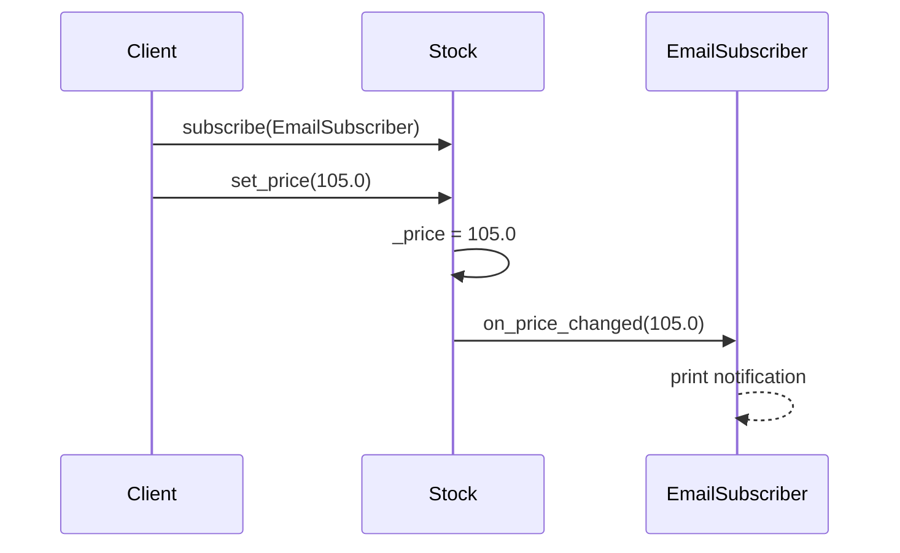
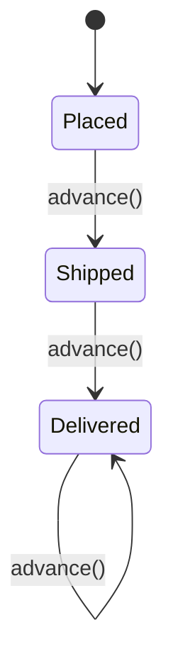

# Module 4: Design Patterns II (Behavioral)

Week 4

## Learning objectives

* Explain how behavioral patterns differ in intent from the creational and structural patterns in
  Module 3
* Implement Strategy, Observer, Command, Template Method, and State
* Recognize when Chain of Responsibility is the right shape for a problem
* Match a concrete design problem to the behavioral pattern that fits it

---

## 1. :material-account-switch: What behavioral patterns are for

Module 3's creational patterns answered "how does an object get built" and its structural
patterns answered "how do objects fit together" (Module 3, §2-§3). Behavioral patterns answer a
third, different question: **how do objects collaborate, and how does an object's behavior change
at runtime** without changing its class. Where a structural pattern like Decorator changes what an
object *is composed of*, a behavioral pattern like Strategy or State changes what an object *does*
when the same method is called again under different conditions. The same caution from Module 3,
§1 applies here too: a pattern is worth its indirection only when the flexibility it buys is
flexibility you actually need.

## 2. :material-swap-horizontal: Strategy

**Reach for this when:** you have several interchangeable algorithms for the same job, and the
choice of algorithm should be swappable independently of the code that uses it.

```python
from abc import ABC, abstractmethod


class DiscountStrategy(ABC):
    @abstractmethod
    def apply(self, price: float) -> float: ...


class NoDiscount(DiscountStrategy):
    def apply(self, price: float) -> float:
        return price


class PercentageDiscount(DiscountStrategy):
    def __init__(self, percent: float) -> None:
        self._percent = percent

    def apply(self, price: float) -> float:
        return price * (1 - self._percent / 100)


class Order:
    def __init__(self, price: float, discount: DiscountStrategy) -> None:
        self._price = price
        self._discount = discount

    def total(self) -> float:
        return self._discount.apply(self._price)


order = Order(100.0, PercentageDiscount(20))
print(order.total())  # 80.0
```

`Order` never has an `if discount_type == "percentage"` chain; swapping in a new discount rule
means writing a new `DiscountStrategy`, not editing `Order`.

## 3. :material-eye-outline: Observer

**Reach for this when:** one object's state change needs to notify an open-ended, possibly
changing set of other objects, without that object needing to know who they are.

```python
from abc import ABC, abstractmethod


class Subscriber(ABC):
    @abstractmethod
    def on_price_changed(self, new_price: float) -> None: ...


class EmailSubscriber(Subscriber):
    def on_price_changed(self, new_price: float) -> None:
        print(f"Emailing: price is now {new_price}")


class Stock:
    def __init__(self, price: float) -> None:
        self._price = price
        self._subscribers: list[Subscriber] = []

    def subscribe(self, subscriber: Subscriber) -> None:
        self._subscribers.append(subscriber)

    def set_price(self, new_price: float) -> None:
        self._price = new_price
        for subscriber in self._subscribers:
            subscriber.on_price_changed(new_price)


stock = Stock(100.0)
stock.subscribe(EmailSubscriber())
stock.set_price(105.0)
```



`Stock` depends only on the `Subscriber` interface; it can gain or lose subscribers at runtime
without any change to its own code.

## 4. :material-play-circle-outline: Command

**Reach for this when:** you need to represent "an action to perform" as an object itself, so it
can be queued, logged, undone, or handed to code that has no idea what the action actually does.

```python
from abc import ABC, abstractmethod


class Command(ABC):
    @abstractmethod
    def execute(self) -> None: ...

    @abstractmethod
    def undo(self) -> None: ...


class Document:
    def __init__(self) -> None:
        self.text = ""


class AppendTextCommand(Command):
    def __init__(self, document: Document, text: str) -> None:
        self._document = document
        self._text = text

    def execute(self) -> None:
        self._document.text += self._text

    def undo(self) -> None:
        self._document.text = self._document.text[: -len(self._text)]


class CommandHistory:
    def __init__(self) -> None:
        self._history: list[Command] = []

    def run(self, command: Command) -> None:
        command.execute()
        self._history.append(command)

    def undo_last(self) -> None:
        if self._history:
            self._history.pop().undo()


doc = Document()
history = CommandHistory()
history.run(AppendTextCommand(doc, "Hello"))
history.run(AppendTextCommand(doc, " World"))
history.undo_last()
print(doc.text)  # "Hello"
```

`CommandHistory` never needs to know what a command actually does; it only ever calls `execute()`
and `undo()`, which is exactly what makes undo/redo, a job queue, or an audit log possible without
touching `Document` at all.

## 5. :material-clipboard-list-outline: Template Method

**Reach for this when:** several algorithms share the same overall skeleton, but a few steps
inside that skeleton differ between them.

```python
from abc import ABC, abstractmethod


class DataImporter(ABC):
    def run(self) -> None:
        raw = self.read_source()
        parsed = self.parse(raw)
        self.load(parsed)

    @abstractmethod
    def read_source(self) -> str: ...

    @abstractmethod
    def parse(self, raw: str) -> list[dict]: ...

    def load(self, records: list[dict]) -> None:
        print(f"Loaded {len(records)} records")


class CsvImporter(DataImporter):
    def read_source(self) -> str:
        return "name,age\nAda,36"

    def parse(self, raw: str) -> list[dict]:
        header, *rows = raw.splitlines()
        keys = header.split(",")
        return [dict(zip(keys, row.split(","))) for row in rows]


CsvImporter().run()
```

`run()` is defined once, in the base class, and never overridden; only the steps that genuinely
differ per format (`read_source`, `parse`) are. This is the inverse of Strategy: Template Method
fixes the skeleton and varies the steps inside a subclass, while Strategy swaps the whole algorithm
in from outside.

## 6. :material-state-machine: State

**Reach for this when:** an object's behavior should change based on its internal state, and an
`if self.state == "..."` chain scattered across every method is becoming the actual source of
bugs.

```python
from abc import ABC, abstractmethod


class OrderState(ABC):
    @abstractmethod
    def next(self, order: "Order") -> None: ...


class Placed(OrderState):
    def next(self, order: "Order") -> None:
        print("Shipping order")
        order.state = Shipped()


class Shipped(OrderState):
    def next(self, order: "Order") -> None:
        print("Delivering order")
        order.state = Delivered()


class Delivered(OrderState):
    def next(self, order: "Order") -> None:
        print("Already delivered, nothing to do")


class Order:
    def __init__(self) -> None:
        self.state: OrderState = Placed()

    def advance(self) -> None:
        self.state.next(self)
```



Each state class owns its own transition logic; adding a new state (say, `Cancelled`) means adding
one new class, not finding and editing every method that currently checks `self.state`.

## 7. :material-link-variant: Chain of Responsibility, briefly

**Reach for this when:** a request should pass through a sequence of possible handlers, and each
handler independently decides whether to handle it, pass it on, or both.

```python
from abc import ABC, abstractmethod


class Handler(ABC):
    def __init__(self) -> None:
        self._next: "Handler | None" = None

    def set_next(self, handler: "Handler") -> "Handler":
        self._next = handler
        return handler

    @abstractmethod
    def handle(self, request: str) -> str | None: ...


class AuthHandler(Handler):
    def handle(self, request: str) -> str | None:
        if request == "unauthenticated":
            return "401 Unauthorized"
        return self._next.handle(request) if self._next else None


class RateLimitHandler(Handler):
    def handle(self, request: str) -> str | None:
        if request == "too_many_requests":
            return "429 Too Many Requests"
        return self._next.handle(request) if self._next else None


auth = AuthHandler()
auth.set_next(RateLimitHandler())
print(auth.handle("ok"))  # None, ok passes through the whole chain
```

This is the shape behind most HTTP middleware stacks: each handler is independently testable, and
the chain's order can be reconfigured without touching any individual handler's code.

## 8. :material-target: Matching a problem to a pattern

| If your problem is... | Reach for... |
|---|---|
| Several interchangeable algorithms should be swappable from outside | Strategy |
| One object's state change must notify an open-ended set of listeners | Observer |
| An action needs to be queued, logged, or undone as an object in its own right | Command |
| Several algorithms share a skeleton but differ in a few steps | Template Method |
| Behavior should change based on internal state, without an if-chain in every method | State |
| A request should pass through an ordered sequence of independent handlers | Chain of Responsibility |

## 9. Project: pattern-driven toy notifier (required)

Extend a small **event notification system** with two behavioral patterns:

1. Build a `Publisher` that holds a list of subscribers and calls each one when an event occurs,
   using **Observer** (§3).
2. Represent at least two different notification behaviors (for example, "send immediately" versus
   "batch and send hourly") as swappable **Strategy** objects (§2) that a subscriber can be
   configured with.
3. Write a short paragraph in your project's own README explaining, in your own words, how the
   Strategy and Observer objects you just wrote differ in intent from the Decorator or Composite
   objects you may have written for Module 3 (Module 3, §3): those wrap or compose structure,
   these change behavior or notify collaborators at runtime.

---

## Summary

Behavioral patterns are about runtime collaboration and runtime behavior change, not about
construction (Module 3, §2) or composition (Module 3, §3). Strategy and Template Method are two
sides of the same coin, swap the whole algorithm versus vary a few steps inside a fixed skeleton
(§2, §5); Observer and Command both decouple a caller from what actually happens, one by
broadcasting a change, the other by turning an action into an object (§3, §4); State and Chain of
Responsibility both replace scattered conditional logic with a set of small, focused classes (§6,
§7). Module 5 zooms out from individual objects to whole-system architectural styles.

## Further reading

* See the [Course books](../README.md#course-books) for deeper dives on applied software design.

## References

* Gamma, Erich, Richard Helm, Ralph Johnson, and John Vlissides. *Design Patterns: Elements of
  Reusable Object-Oriented Software.* Addison-Wesley, 1994. The original catalog every pattern in
  this module comes from.
* [Refactoring Guru, "Design Patterns."](https://refactoring.guru/design-patterns) A visual,
  language-agnostic reference covering the same behavioral patterns used here.
