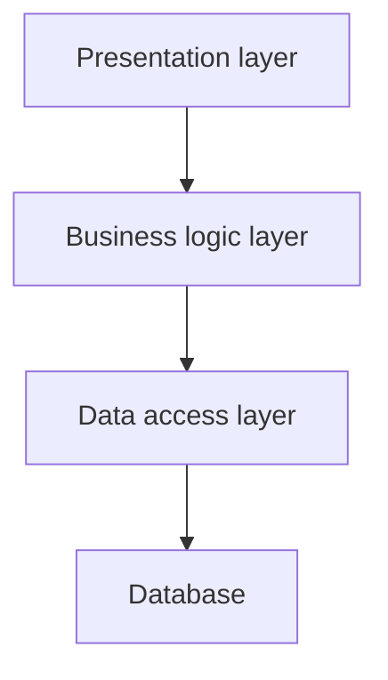
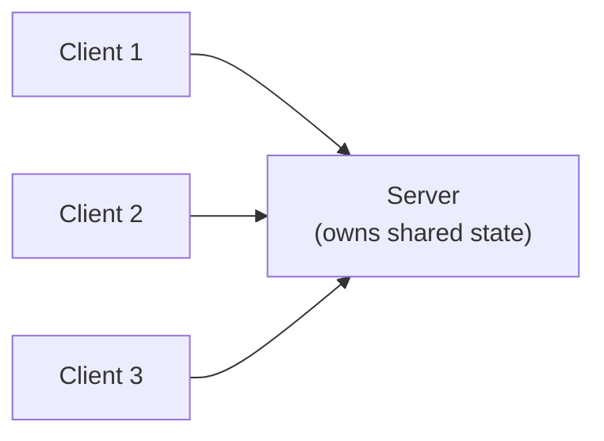
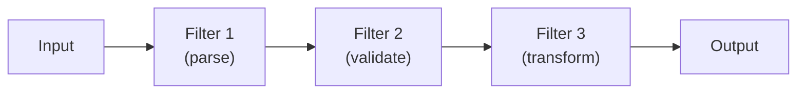
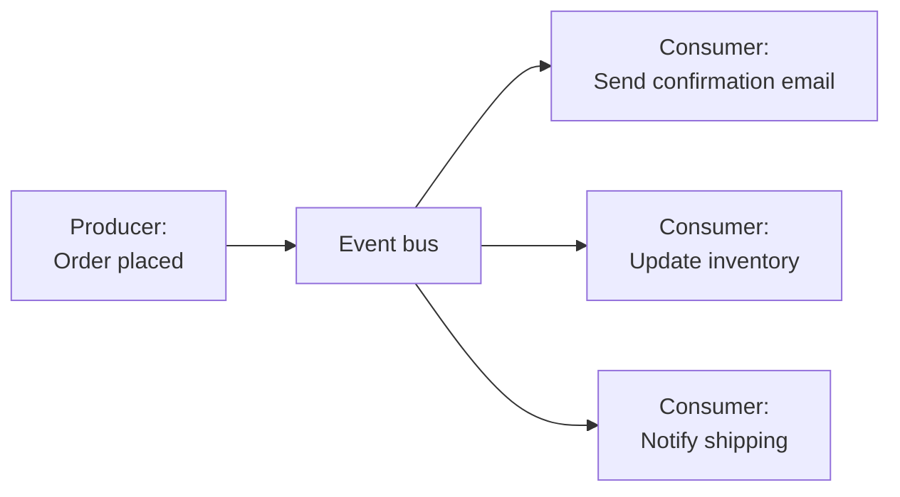
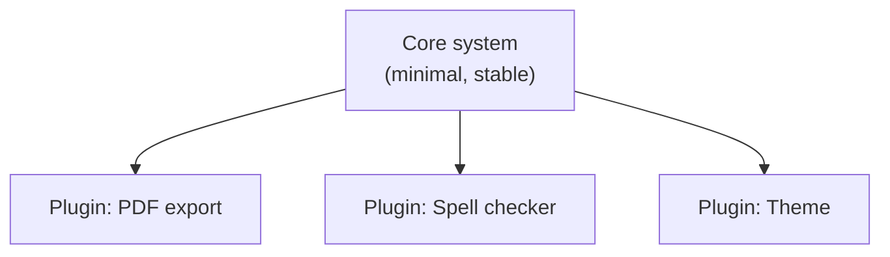

# Module 5: Architectural Styles & Patterns

Week 5

## Learning objectives

* Recognize the major architectural styles and the shape each one imposes on a system
* Explain which quality attributes a given style tends to favor, and which it tends to cost
* Choose an architectural style for a real system and justify the choice in writing

---

## 1. :material-compass-outline: Why architectural style is a first decision, not a detail

An architectural style is a reusable, named solution to the problem of how a system's components
are decomposed and how they communicate. Choosing one is one of the most expensive decisions a
team makes, because it is exactly the kind of decision Module 1 called architectural rather than
design: changing a system's style after the fact usually means rewriting how every component talks
to every other component, not editing one class.

None of the styles below is "the best" one. Each is a specific bet on which quality attributes
matter most for a given system, made at the cost of the quality attributes it does not favor. The
skill this module builds is matching a style to a system's actual constraints, not memorizing which
style is fashionable.

## 2. :material-layers-outline: Layered architecture

A layered architecture stacks components into horizontal layers, where each layer only calls the
layer directly below it (a presentation layer calls a business logic layer, which calls a data
access layer, and so on).

A typical web application's controller/service/repository split is a layered architecture in
practice. It favors **maintainability**, since a change to the database schema is isolated to the
data access layer, and **testability**, since each layer can be tested against a mock of the layer
below it. It costs **performance**, since every request pays the cost of passing through every
layer even when a shortcut would be faster, and it can quietly turn into a "distributed monolith"
if teams start bypassing layers under deadline pressure.

## 3. :material-server-network: Client-Server

A client-server architecture splits a system into a server that provides a service and one or more
clients that consume it over a network, with the server owning the shared state.

A REST API backing a mobile app is the most common example. It favors **scalability**, since
clients can be added without changing the server, and **security**, since sensitive state stays on
a server you control rather than on every client device. It costs **availability** from the
client's point of view: if the server is down, every client is down with it, unless the team
invests separately in server redundancy.

## 4. :material-pipe: Pipe-and-Filter

A pipe-and-filter architecture processes data through a sequence of independent filters, each one
transforming its input and passing the result to the next filter through a pipe.

A Unix command pipeline (`cat file | grep error | sort | uniq -c`) is the canonical example; a data
processing or ETL pipeline is the same shape at a larger scale. It favors **reusability**, since a
filter with no knowledge of its neighbors can be reused in a different pipeline, and
**modifiability**, since inserting a new filter does not require changing existing ones. It costs
**performance** on interactive systems, since data typically flows through the whole pipeline even
when only one filter's output is needed, and it is a poor fit when filters need to share state or
run in a specific non-linear order.

## 5. :material-lightning-bolt: Event-Driven architecture

An event-driven architecture decouples components so that producers publish events without knowing
who, if anyone, is listening, and consumers subscribe to the events they care about.

An e-commerce system where placing an order triggers an email, an inventory update, and a shipping
notification, each handled by a separate consumer that does not know the others exist, is a
typical case. It favors **modifiability** (add a new consumer without touching the producer) and
**scalability** (consumers can be scaled independently), at the cost of **testability**: tracing
what happened for one event across every consumer that reacted to it is genuinely harder than
following a single call stack, and eventual consistency between consumers becomes a real design
concern rather than a footnote.

## 6. :material-view-dashboard-outline: MVC (Model-View-Controller)

MVC splits an application into a Model (the data and business rules), a View (the presentation of
that data), and a Controller (which translates user input into changes to the model and choices
about which view to render).

Almost every web framework (Django, Rails, Spring MVC) is built around this split. It favors
**maintainability**, since the same model can be rendered by more than one view without
duplicating business logic, and it makes UI and business-logic changes largely independent of each
other. It costs some **simplicity** for small applications, where the ceremony of three separate
components for what is really one small feature can be more overhead than it is worth.

## 7. :material-power-plug-outline: Microkernel / Plugin architecture

A microkernel architecture keeps a minimal core system and pushes everything else into plugins that
the core loads and calls through a stable interface, without the core needing to know what any
specific plugin does.

VS Code's extension system and Eclipse's plugin architecture are both microkernel designs. It
favors **extensibility**, since third parties can add capability without touching the core, and
**modifiability** of the core itself, which stays small and rarely needs to change. It costs
**performance and reliability guarantees**: a misbehaving plugin can degrade or crash the whole
system unless the core invests in isolating plugin failures.

## 8. :material-scale-balance: Comparing the styles

| Style | Favors | Costs |
|---|---|---|
| Layered | Maintainability, testability | Performance, risk of bypassed layers |
| Client-Server | Scalability, security | Availability (single point of failure) |
| Pipe-and-Filter | Reusability, modifiability | Performance on interactive workloads |
| Event-Driven | Modifiability, scalability | Testability, consistency guarantees |
| MVC | Maintainability, UI/logic independence | Simplicity for small applications |
| Microkernel / Plugin | Extensibility, core stability | Performance and reliability isolation |

Real systems frequently combine styles rather than picking exactly one: a web application is
commonly layered internally, exposes a client-server API at its boundary, and uses an event-driven
pattern for background work like sending emails. The question worth asking is never "which style is
correct," but "which quality attributes does this specific system need most, and which style buys
those at the smallest cost."

## 9. Project: choose and justify an architectural style (required)

For your own group project (the one that continues into Sprint A, Module 2, §3), choose one
architectural style from §2-§7, or a deliberate combination of two. Write a 2-3 paragraph
justification covering: which quality attributes matter most for your specific system, why the
chosen style favors those attributes, and what you are explicitly giving up by not choosing a
different style. This justification is a required Sprint A deliverable.

---

## Summary

An architectural style is a named, reusable answer to how a system's components are shaped and how
they talk to each other, and every style in this module is a deliberate trade: layered
architecture buys maintainability at the cost of performance, event-driven architecture buys
modifiability at the cost of testability, and so on down the list. The skill is not memorizing
which style is currently popular, it is being able to name which quality attribute your system
actually needs most, and picking the style that buys it most cheaply.

## Further reading

* See the [Course books](../README.md#course-books) for deeper dives on applied software
  architecture.

## References

Foundational sources this module's content draws on:

* Bass, Len, Clements, Paul, and Kazman, Rick. *Software Architecture in Practice.* Addison-Wesley.
  Source for the architectural styles and quality-attribute trade-off framing throughout this
  module.
* Fowler, Martin. Writings on architectural styles and patterns. [martinfowler.com](https://martinfowler.com/).
  Source for the event-driven and MVC framing in §5-§6.
