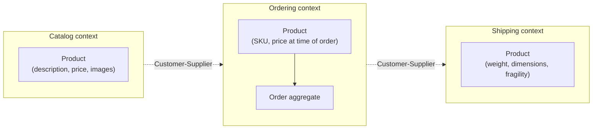

# Module 6: Domain-Driven Design & Modular Design

Week 7

## Learning objectives

* Distinguish entities, value objects, and aggregates, and explain why aggregate boundaries matter
* Identify bounded contexts in a domain, and name the standard relationships between them
* Carve a real domain into at least two bounded contexts and justify the boundary

---

## 1. Why domain-driven design

Domain-driven design (DDD) is a set of practices for structuring software around the business
domain it serves, rather than around technical layers alone. The core claim is simple: a codebase
that mirrors how domain experts actually talk about the problem is easier to change correctly than
one that mirrors only the database schema or the framework's folder conventions. This module gives
you the vocabulary and the modeling tools; Module 7 (Microservices) picks this up directly, since
bounded contexts are the most common basis for deciding where a system's service boundaries
actually go.

## 2. Ubiquitous language

The **ubiquitous language** is the shared vocabulary between developers and domain experts, used
consistently in conversation, documentation, and code. If a domain expert says "reservation" and
the code says `Booking`, that gap is not cosmetic: it is a translation cost paid every single time
someone needs to connect a bug report to the class that causes it. The practical habit this module
asks you to build is renaming code to match the domain expert's own words, not the other way
around.

## 3. Entities vs. value objects

An **entity** has a persistent identity that outlives changes to its attributes: a `Customer`
is still the same customer after changing their address. A **value object** has no identity of its
own; it is defined entirely by its attributes, and two value objects with the same attributes are
interchangeable: a `Money` object representing 50 EUR is equal to any other `Money` object
representing 50 EUR, and neither needs to be tracked as "the same instance" over time.

```python
class Customer:  # entity: identity matters
    def __init__(self, customer_id: str, name: str):
        self.customer_id = customer_id
        self.name = name

class Money:  # value object: only the value matters
    def __init__(self, amount: float, currency: str):
        self.amount = amount
        self.currency = currency

    def __eq__(self, other):
        return self.amount == other.amount and self.currency == other.currency
```

Getting this distinction right early avoids a specific class of bug: treating a value object as if
it needed identity tracking adds pointless bookkeeping, and treating an entity as if it were a
value object loses the ability to answer "is this the same customer as before."

## 4. Aggregates and consistency boundaries

An **aggregate** is a cluster of entities and value objects treated as one consistency unit,
accessed and modified only through a single entry point called the **aggregate root**. An `Order`
aggregate might contain `OrderLine` entities and a `Money` total; nothing outside the aggregate is
allowed to modify an `OrderLine` directly, it must go through the `Order` root, which is what keeps
invariants like "the total always equals the sum of the lines" from being violated by code
elsewhere in the system.

The practical rule of thumb: an aggregate boundary should be exactly as large as it needs to be to
enforce one consistency rule, and no larger. Aggregates that grow too large become a concurrency
bottleneck, since every change to any part of the aggregate typically has to lock the whole thing.

## 5. Bounded contexts

A **bounded context** is a boundary within which a specific model and its ubiquitous language
apply consistently. The same word can mean genuinely different things in different bounded
contexts: "Product" in a Catalog context means something with a description, images, and a price;
"Product" in a Shipping context means something with a weight, dimensions, and a fragility flag.
Trying to force one shared `Product` class to serve both contexts is exactly the mistake bounded
contexts exist to prevent: it is Module 2's low-cohesion problem, at the scale of an entire
subsystem instead of one class.

## 6. Context mapping

When two bounded contexts need to interact, the relationship between them needs to be named
explicitly, since each pattern implies a different amount of coupling:

| Pattern | What it means |
|---|---|
| **Shared Kernel** | Two contexts deliberately share a small piece of model, and changes to it require both teams' agreement |
| **Customer-Supplier** | One context's team (the supplier) builds to serve another context's team (the customer), with the customer's needs prioritized |
| **Anticorruption Layer** | A translation layer at the boundary that converts one context's model into another's, so a legacy or third-party context's model never leaks in unmodified |

An Anticorruption Layer is the pattern worth remembering first, since it is the direct answer to
"we have to integrate with a messy legacy system, but we don't want its model polluting ours."

## 7. A worked example: bounded contexts in an e-commerce system



Each context has its own notion of "Product," containing only the attributes that context actually
cares about, translated at the boundary rather than shared as one universal class. This is the same
shape Module 7 will formalize into service boundaries: a Catalog service, an Ordering service, and
a Shipping service, each owning its own context's model.

## 8. Project: identify bounded contexts in your own project (required)

For your own group project's domain, identify at least two bounded contexts. For each, name one
concrete thing that changes independently in that context but not in the other (a field that gets
added, a business rule that gets updated) as concrete evidence that the boundary is real and not
arbitrary. Note which context mapping pattern from §6, if any, applies between them.

---

## Summary

Domain-driven design gives you the vocabulary to carve a system along the same lines domain
experts already think in: entities that need identity, value objects that don't, aggregates that
enforce one consistency rule each, and bounded contexts that let the same word mean different
things in different parts of the system without anyone being wrong. Module 7 takes the bounded
contexts identified here and asks the next question: should each one become its own deployable
service?

## Further reading

* See the [Course books](../README.md#course-books) for deeper dives on applied software
  architecture.

## References

Foundational sources this module's content draws on:

* Evans, Eric. *Domain-Driven Design: Tackling Complexity in the Heart of Software.*
  Addison-Wesley. Source for the ubiquitous language, entity/value object, aggregate, and bounded
  context concepts throughout this module.
* Fowler, Martin. "BoundedContext." [martinfowler.com/bliki/BoundedContext.html](https://martinfowler.com/bliki/BoundedContext.html).
  Source for the bounded context and context mapping framing in §5-§6.
