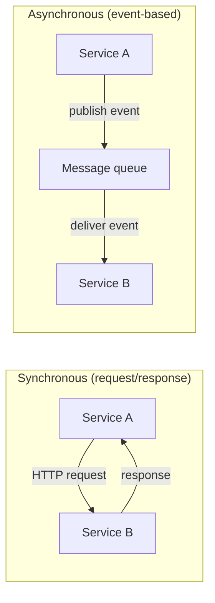

# Module 7: Microservices Architecture

Week 8

## Learning objectives

* Understand what decomposing a system into services actually buys you, and what it costs
* Use Module 6's bounded contexts as the basis for drawing service boundaries
* Design a REST API for a service boundary, including basic versioning
* Distinguish synchronous and asynchronous communication between services, and know when each fits

---

## 1. What decomposition buys you, and what it costs

A microservices architecture splits a system into multiple independently deployable services,
each owning its own data and business logic. The appeal is real: a team can deploy their service
without coordinating a release with every other team, a service under heavy load can be scaled on
its own, and a service with unusual requirements can use a different language or database than the
rest of the system. None of that is available to a single deployable unit, no matter how cleanly
its internals are organized.

The cost is just as real, and it is easy to underestimate before you have paid it. A function call
inside one process is nanoseconds and cannot partially fail. A call to another service crosses the
network, which means it can be slow, can time out, and can fail in ways a function call never
does. Data that used to live in one database, updatable in one transaction, now lives in several
databases with no shared transaction, so keeping it consistent becomes an explicit design problem
rather than something a relational database gives you for free. Operationally, you now have
several things to deploy, monitor, and version instead of one.

The practical rule: microservices are a tool for scaling *organizations and deployment
independence*, not a tool for making software "better" in the abstract. A team of four people
building a system nobody else touches rarely benefits from paying the distributed-systems tax this
early. Module 8 covers the resilience patterns that pay for some of that tax; this module is about
deciding where to pay it in the first place.

## 2. Where to draw the boundary

The single most common mistake in adopting microservices is drawing service boundaries around
technical layers (a "database service," a "UI service") instead of around business capabilities.
That produces services that must be deployed together anyway, because a single business change
touches all of them: you have paid the cost of distribution without getting independent
deployability in return.

Module 6's bounded contexts are exactly the right starting point for a service boundary, because a
bounded context is already the place where a term has one consistent meaning and one team's model
applies. A service that maps 1:1 onto a bounded context tends to change for its own reasons, own
its own data, and rarely need a synchronous call back into another service just to complete a
single business operation. If you find a proposed service boundary needs constant chatty calls
back and forth with another service to do anything useful, that is usually a sign the boundary
was drawn in the wrong place: reconsider whether it should be one bounded context, not two.

## 3. Designing the API at the boundary

Once a boundary is drawn, something has to define the contract other services (and other clients)
use to talk across it. A REST API models the boundary as a set of resources, addressed by URLs,
manipulated through a small, uniform set of HTTP methods:

| Method | Meaning | Example |
|---|---|---|
| `GET` | Read a resource | `GET /orders/482` |
| `POST` | Create a resource | `POST /orders` |
| `PUT` / `PATCH` | Replace / partially update a resource | `PATCH /orders/482` |
| `DELETE` | Remove a resource | `DELETE /orders/482` |

Resource names are nouns, not verbs (`/orders`, not `/createOrder`), and nesting reflects real
ownership (`/customers/17/orders`, if orders genuinely belong to a customer in your model).

**Versioning matters the moment another team depends on your API**, because you can no longer
change the contract in place without breaking them. The simplest approach, a version segment in
the URL (`/v1/orders`, `/v2/orders`), is blunt but easy for every client to reason about; header-
or content-negotiation-based versioning exists too, at the cost of being less visible. Whichever
you choose, the discipline that matters is deciding *before* the first external caller shows up,
not after.

## 4. Synchronous versus asynchronous communication

Two services can talk to each other in two fundamentally different shapes:



**Synchronous (HTTP/REST)** is the simpler mental model: Service A calls Service B, waits, and gets
a result back, exactly like a function call except across the network. It is the right default
when A genuinely needs B's answer before it can proceed. Its weakness is coupling in time: if B is
slow or down, A is blocked (Module 8, §2 covers exactly this failure mode and the patterns that
mitigate it).

**Asynchronous (message queue / event-based)** decouples the two services in time: A publishes an
event ("OrderPlaced") and moves on immediately; B (and any other interested service) picks it up
whenever it is ready. This is the right shape when A does not need an immediate answer, and when
you want new services to be able to react to the same event later without A having to know they
exist. The cost is that reasoning about the system now requires thinking about eventual
consistency and message ordering, both of which have no equivalent in the synchronous case.

## 5. A minimal example: two services talking over HTTP

A tiny "orders" service, exposing one endpoint with FastAPI:

```python
# orders_service.py
from fastapi import FastAPI

app = FastAPI()
_orders = {1: {"id": 1, "item": "widget", "quantity": 3}}

@app.get("/v1/orders/{order_id}")
def get_order(order_id: int):
    return _orders.get(order_id, {"error": "not found"})
```

A second service calling it with `httpx`, the way a "shipping" service might need order details
before it can create a shipment:

```python
# shipping_service.py
import httpx

def fetch_order(order_id: int) -> dict:
    response = httpx.get(f"http://localhost:8000/v1/orders/{order_id}")
    response.raise_for_status()
    return response.json()
```

This is deliberately the smallest possible version of the pattern: one service owns and serves its
own data, a second service depends on it only through its public HTTP contract, never by reaching
into its database directly. Module 8 picks this exact call up and adds a resilience pattern around
it, because right now, if `orders_service` is down, `fetch_order` raises an unhandled exception.

## 6. Project: decompose the group project into services (required)

Take your Sprint A project and do one of two things, and defend the choice in writing:

* **Split it into at least two independently deployable services**, drawn along a bounded context
  from Module 6, §2. Implement at least one real HTTP call between them (following §5's pattern),
  and document the API contract at that boundary using §3's conventions.
* **Argue for keeping it a single service**, explicitly listing what §1 said microservices buy you
  (independent scaling, independent deployment, technology heterogeneity) and explaining why your
  project would not actually benefit from any of them at its current size and team structure.

Either answer is acceptable; an unexamined default in either direction is not.

---

## Summary

Microservices trade a single deployable unit for independent deployability, at the real cost of
network calls that can fail in ways function calls cannot, and data consistency that is no longer
free. Module 6's bounded contexts are the right place to draw the resulting service boundaries,
because a boundary drawn around a business capability tends to need far fewer chatty cross-service
calls than one drawn around a technical layer. Once boundaries exist, a REST API with a versioning
plan (§3) and a deliberate choice between synchronous and asynchronous communication (§4) is what
actually implements the boundary in code. Module 8 continues directly from here: every
cross-service call this module introduces is exactly the kind of call that needs a resilience
pattern wrapped around it.

## Further reading

* See the [Course books](../README.md#course-books) for deeper dives.

## References

* Newman, Sam. *Building Microservices: Designing Fine-Grained Systems.* O'Reilly, 2021. Source
  for the decomposition trade-offs in §1 and the boundary-drawing guidance in §2.
* [The Twelve-Factor App](https://12factor.net/). A widely cited methodology for building
  service-based applications, relevant to the API and configuration discipline in §3.
