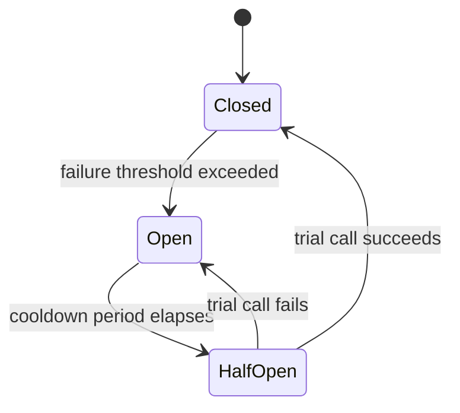

# Module 8: Distributed Systems & Resilience Patterns

Week 9

## Learning objectives

* State the CAP theorem and apply it to a concrete design decision
* Recognize the failure modes that are unique to distributed systems
* Apply Retry, Circuit Breaker, Timeout, and Bulkhead patterns to a real inter-service call
* Explain what specific failure each resilience pattern protects against

---

## 1. The CAP theorem

The moment Module 7's services are separate processes on separate machines, a network partition
between them becomes possible: a link can drop, a machine can become unreachable, while both
sides stay up and healthy on their own. The CAP theorem says that when a partition happens, a
distributed data store can give you at most two of three properties, not all three:

* **Consistency**: every read sees the most recent write, or an error.
* **Availability**: every request gets a (non-error) response.
* **Partition tolerance**: the system keeps working despite a partition.

Since a real network can always partition, partition tolerance is not really optional, which
means the actual choice you are making is between consistency and availability *specifically
during a partition*. A banking ledger usually chooses consistency: it would rather reject a
transfer than risk two branches disagreeing about a balance. A social media "like" counter usually
chooses availability: it would rather show a slightly stale count than refuse to load the page.
Neither choice is universally correct; it is a property of what the specific data means to the
system, decided deliberately, the same way Module 5 asked you to justify an architectural style
against the quality attributes that actually matter for your system.

## 2. Failure modes unique to distributed systems

A single process either runs or crashes. A distributed system fails in shapes that have no
single-process equivalent:

* **Network partition**: two healthy services simply cannot reach each other for a while.
* **Slow, not down**: a service responds, just far slower than usual, which is often harder to
  handle correctly than an outright failure, because nothing tells the caller to give up.
* **Cascading failure**: Service A calls slow Service B and blocks waiting; if A has a limited
  pool of threads or connections, enough blocked calls to B exhaust that pool, and A becomes
  unavailable to *everyone*, including callers who had nothing to do with B. One slow service
  takes down its callers, and then its callers' callers.

Every pattern in this module exists to stop one of these three failure modes from spreading.

## 3. Retry

The simplest response to a failed call is to try again, since many failures (a dropped packet, a
momentarily overloaded service) are transient. Retrying blindly and immediately is a common
mistake: if the callee is overloaded, an instant retry from every caller just adds to the load that
caused the failure in the first place. **Exponential backoff** waits progressively longer between
attempts, giving the callee room to recover:

```python
from tenacity import retry, stop_after_attempt, wait_exponential
import httpx

@retry(stop=stop_after_attempt(4), wait=wait_exponential(multiplier=1, min=1, max=10))
def fetch_order(order_id: int) -> dict:
    response = httpx.get(f"http://localhost:8000/v1/orders/{order_id}", timeout=2)
    response.raise_for_status()
    return response.json()
```

Retry only helps with the failure mode in §2 that is actually transient; retrying a request that
is failing because the data itself is invalid just wastes four calls to get the same permanent
error a fifth time.

## 4. Timeout

Retry only matters if the caller does not wait forever for the response it is retrying. Every
network call needs an explicit timeout, exactly the `timeout=2` argument in §3's example: without
one, a slow-not-down failure (§2) turns a caller's thread into one more thread quietly blocked
waiting, which is precisely the setup for a cascading failure. Choosing the timeout value is a
real design decision: too short, and you abandon calls that would have succeeded; too long, and
you have not actually protected yourself from the slow-caller problem.

## 5. Circuit breaker

Retrying a call to a service that is *fully* down, not just transiently slow, just delays the
inevitable failure while adding load to a system that is already struggling. A circuit breaker
tracks recent failures and, once they cross a threshold, stops attempting the call at all for a
cooldown period, failing immediately instead:



* **Closed**: calls go through normally; failures are counted.
* **Open**: calls fail immediately without even attempting the network call, protecting both the
  caller (no more blocked threads) and the struggling callee (no more load added to it).
* **Half-open**: after the cooldown, exactly one trial call is allowed through. Success closes the
  circuit again; failure reopens it and restarts the cooldown.

The circuit breaker is what turns "keep retrying a dead service forever" into "give up cleanly and
let the caller decide what to do instead," which is usually a fallback response, a cached value,
or a clear error to the end user rather than a hang.

## 6. Bulkhead

Named after a ship's watertight compartments, a bulkhead isolates the resources (thread pools,
connection pools) used to call *different* dependencies, so that one dependency's failure cannot
exhaust the resources another dependency needs. Concretely: if Service A calls both Service B and
Service C, giving each call its own bounded connection pool means a flood of slow calls to B can
fill up only B's pool, not the shared pool C's calls also need. Without a bulkhead, this is exactly
how the cascading failure in §2 spreads to dependencies that were never actually unhealthy.

## 7. Project: add a resilience pattern to the Module 7 call (required)

Take the inter-service call from Module 7, §5 (or your project's own equivalent) and apply at
least one resilience pattern from this module. For your chosen pattern, write down: which specific
failure mode from §2 it protects against, what happens to the caller when the pattern activates
(does it get an error, a fallback value, or does it wait), and one deliberate trade-off the pattern
introduces (retry adds latency on failure; a circuit breaker can reject calls to a service that
has actually already recovered, during its cooldown).

---

## Summary

The CAP theorem (§1) forces a deliberate choice between consistency and availability during a
partition, because partition tolerance itself is not optional on a real network. The failure modes
in §2, especially the way one slow dependency cascades into its callers, are what Retry (§3),
Timeout (§4), Circuit Breaker (§5), and Bulkhead (§6) each address, and each pattern protects
against a specific failure mode rather than being a generic "make it more reliable" switch. Module
9 picks this module's decisions up directly: choosing a resilience pattern, and why, is exactly the
kind of trade-off an Architecture Decision Record exists to capture.

## Further reading

* See the [Course books](../README.md#course-books) for deeper dives.

## References

* Gilbert, Seth, and Nancy Lynch. "Brewer's Conjecture and the Feasibility of Consistent,
  Available, Partition-Tolerant Web Services." *ACM SIGACT News*, 2002. The formal proof behind
  the CAP theorem in §1, originally conjectured by Eric Brewer.
* [Tenacity documentation](https://tenacity.readthedocs.io/). Source for the retry-with-backoff
  example in §3.
