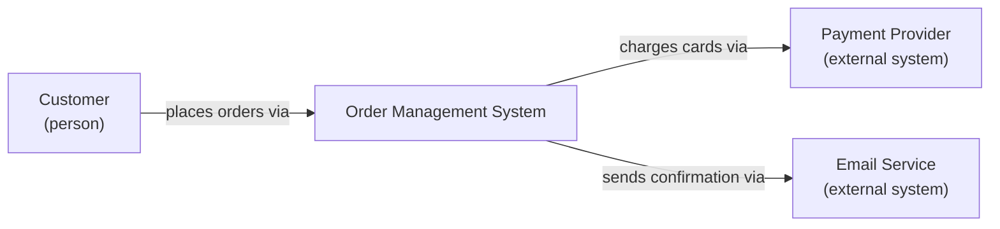
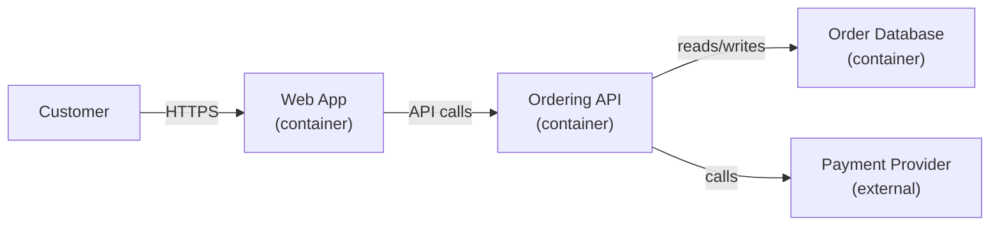

# Module 9: Architecture Documentation & Decision Making

Week 10

## Learning objectives

* Understand why architecture specifically, not just code, needs its own documentation
* Be able to draw C4 Context and Container diagrams for a real system
* Know the 4+1 view model as an alternative framing for the same underlying concerns
* Be able to write an Architecture Decision Record (ADR) for a real trade-off

---

## 1. Why architecture needs its own documentation

Code documents itself, eventually, to a reader willing to trace every call. Architecture does
not: the reason a system has three services instead of one, or a queue between two components
instead of a direct call, usually lives in a decision made under time pressure, in a meeting, and
nowhere in the code. Three groups need that reasoning written down. A new team member needs it to
stop re-deriving decisions everyone else already made. Future you needs it, since six months from
now you will not remember why you chose PostgreSQL over MongoDB, only that you did. And anyone
auditing the system later, including yourself during Module 10's evaluation, needs to know which
trade-offs were made on purpose versus which just happened.

## 2. The C4 model

The [C4 model](https://c4model.com/) gives architecture diagrams four levels of zoom, each useful
to a different audience, so you stop cramming a database, a load balancer, and a single class
onto one overwhelming diagram.

| Level | Shows | Audience |
|---|---|---|
| **Context** | The system as one box, plus the people and other systems it talks to | Anyone, including non-technical stakeholders |
| **Container** | The system split into its deployable units (a web app, an API, a database) | Technical staff, including new team members |
| **Component** | One container split into its major internal building blocks | Developers working on that container |
| **Code** | Classes and their relationships (this is what UML class diagrams already do) | Developers working on that specific component |

A worked example, a small order-management system:



That is the Context diagram: one box, its people, its external systems. Zooming in one level to
Container:



Component and Code diagrams keep zooming in the same way, one container or one class at a time.
This course has already been drawing Code-level diagrams throughout, since a mermaid class or
sequence diagram *is* a UML diagram: the tool is the same, only the label (C4 versus plain UML)
changes.

## 3. The 4+1 view model

The [4+1 view model](https://en.wikipedia.org/wiki/4%2B1_architectural_view_model), proposed by
Philippe Kruchten, covers similar ground to C4 from a different angle: instead of levels of zoom,
it separates concerns into five views of the same system.

| View | Answers |
|---|---|
| **Logical** | What are the key abstractions and their relationships? (close to C4's Component/Code) |
| **Process** | What runs concurrently, and how do processes communicate? |
| **Development** | How is the codebase organized into modules, and who owns what? |
| **Physical** | What hardware or infrastructure does each piece run on? |
| **Scenarios** | Do the other four views actually satisfy the system's key use cases? (the "+1", which validates the rest) |

You will not use both C4 and 4+1 on every project. C4's zoom levels are the more common default
today, especially for anything web- or service-based; 4+1's process and physical views earn their
keep on systems with real concurrency or deployment topology questions, the kind Module 8's
distributed systems content raises. Knowing the second exists means recognizing when a C4 diagram
alone is not answering the question a stakeholder is actually asking.

## 4. Architecture Decision Records

An **Architecture Decision Record (ADR)** is a short, timestamped document capturing one decision,
written at the moment it is made, not reconstructed later. The standard format, popularized by
Michael Nygard:

| Field | Content |
|---|---|
| **Title** | A short noun phrase naming the decision |
| **Status** | Proposed, Accepted, Superseded, or Deprecated |
| **Context** | The forces at play: constraints, requirements, the problem that needs deciding |
| **Decision** | The choice actually made, stated plainly |
| **Consequences** | What becomes easier, what becomes harder, as a direct result |

Not every choice deserves an ADR. Write one when reversing the decision later would be expensive:
a database engine, a communication protocol between services, an authentication scheme. Do not
write one for a decision you could undo in an afternoon by editing a function.

A full worked example:

```markdown
# ADR-003: Use PostgreSQL over MongoDB for the Ordering service

## Status
Accepted

## Context
The Ordering service needs to store orders, each with a fixed set of line items, and must
support transactional consistency across an order and its payment record (Module 8, §2). The
team already runs PostgreSQL for two other services, so operational familiarity is not a
differentiator either way.

## Decision
Use PostgreSQL. The data is naturally relational (orders, line items, payments, each with clear
foreign-key relationships), and the transactional guarantees PostgreSQL gives us directly satisfy
the consistency requirement without extra application-level coordination.

## Consequences
Schema changes now go through migrations rather than being schema-free, which is more overhead
per change but catches a class of bugs earlier. Horizontal write scaling is harder than it would
be with MongoDB, which is an acceptable trade-off given current and projected order volume.
```

## 5. Project: document your architecture (required)

For your own group project: draw a C4 Context diagram (your system, its users, the external
systems it talks to) and a Container diagram (your system's deployable pieces and how they
connect). Then write one real ADR for a decision your group actually made, using the format
above; it should be specific enough that another group reading it would understand exactly why
you chose what you chose, and what you gave up to get it.

---

## Summary

Architecture documentation exists to answer one recurring question: why does this system look
the way it does? C4 (§2) and 4+1 (§3) are two ways to draw the *structure* so someone else can see
it at the right level of zoom; an ADR (§4) is how you capture the *reasoning* behind one specific
structural choice, at the moment it is made, before it is forgotten. Module 10 picks this up
directly: you cannot evaluate a design's quality attributes rigorously if nobody wrote down which
trade-offs were deliberate.

## Further reading

* See the [Course books](../README.md#course-books) for deeper dives.

## References

* [The C4 model for visualising software architecture](https://c4model.com/). Source for the four
  levels of abstraction and the worked example in §2.
* Nygard, Michael. ["Documenting Architecture Decisions."](https://cognitect.com/blog/2011/11/15/documenting-architecture-decisions)
  2011. Source for the ADR format and its rationale in §4.
* Kruchten, Philippe. ["Architectural Blueprints: The 4+1 View Model of Software Architecture."](https://www.cs.ubc.ca/~gregor/teaching/papers/4+1view-architecture.pdf)
  IEEE Software, 1995. Source for the five-view model in §3.
